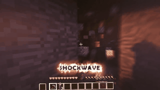
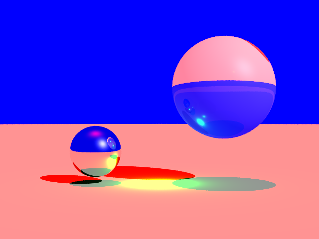

Hello, I'm Andrew 👋🏼. Please email me for my resume or for general inquiries: `andrew (dot) gazelka (at) gmail (dot) com` 

I'm currently a full stack developer with [@eitmn](https://github.com/eitmn) (contract for United Health Group and similarly sized companies), but I also enjoy other fields such as machine learning and parallel computing. Although I am mostly self-taught, I am majoring in CSCI and expect to recieve my degree from University of Minnesota in spring 2021.

Some things I ❤️ that you should look at!
-    [Structured concurrency](https://vorpus.org/blog/notes-on-structured-concurrency-or-go-statement-considered-harmful/)
- 🦀 [Memory ownership](https://doc.rust-lang.org/book/ch04-01-what-is-ownership.html)
- 🎧 [CoRecursive podcast](https://open.spotify.com/show/2LQQb08WTikg5SO85TzoxM?si=lkkmkUYZTiq2qX4aNlNR1A)
- 🐱 [Git Rebase](https://git-scm.com/docs/git-rebase)
- ⌨️ [IdeaVim](https://github.com/JetBrains/ideavim)
- 🧼 [Clean Code](http://blog.cleancoder.com/)

The classes I am currently taking are:
- 💻 Computer Graphics
- 📷 Computer Vision
- 🧠 Machine Learning
- 🗃 Data Mining
- ⚡️ Parallel Computing

I consider myself competent in:

|Topic|List|
|--------|-----|
|Languages|Kotlin, Rust, C(++), Dart, Go, Python, JS/TS, Java|
|Frameworks|Angular, Flutter, NestJS|
|Databases|MySQL, MariaDB, Postgres, MongoDB, Redis|

What I am learning independently
- Haskell (I love immutability and FP!)
- GPU programming
- ReasonML (OCaml variant) with React

Favorite things I have made:

|Project|Description|Demonstration|
|--------|-----|-------|
|[ezAuton](https://github.com/ezAuton/ezAuton/)|A library for autonomous vehicle navigation I made in my junior & senior years of high school. Uses Java and Kotlin.||
|[OneShotMC](https://youtu.be/XD1uop6fzR8)|My former Minecraft server I developed/created, which had over 100k unique joins. Uses a bunch of Kotlin, Java, and a little bit of TypeScript/Python/JavaScript for web applications.||
|[Ray tracer](https://github.com/andrewgazelka/csci5607-proj3)|A project for my computer graphics class made in C++||
