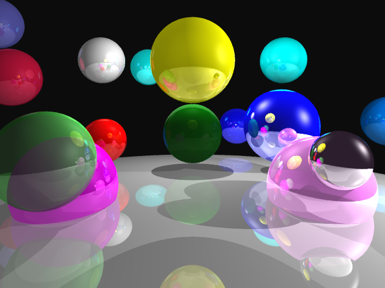

### Hello, I'm Andrew 👋🏼. 

**Please email me for my resume** or for general inquiries: `andrew (dot) gazelka (at) gmail (dot) com`. My Discord is `Andrew Gazelka#0001`. Most of my code is private. If you want an overview of it to access my proficiency, please contact me.

Some things I ❤️ that you should look at!
-    [Structured concurrency](https://vorpus.org/blog/notes-on-structured-concurrency-or-go-statement-considered-harmful/)
- 🦀 [Memory ownership](https://doc.rust-lang.org/book/ch04-01-what-is-ownership.html)
- 🎧 [CoRecursive podcast](https://open.spotify.com/show/2LQQb08WTikg5SO85TzoxM?si=lkkmkUYZTiq2qX4aNlNR1A)
- 🐱 [Git Rebase](https://git-scm.com/docs/git-rebase)
- ⌨️ [IdeaVim](https://github.com/JetBrains/ideavim)
- 🧼 [Clean Code](http://blog.cleancoder.com/)

This week, my programming time (not counting work done on work laptop) has been spent as follows:

  

I consider myself competent in:

|Topic|List|
|--------|-----|
|Languages|Kotlin, Rust, C(++), Dart, Go, Python, JS/TS, Java|
|Frameworks|Angular, Flutter, NestJS|
|Databases|MySQL, MariaDB, Postgres, MongoDB, Redis|

What I am learning independently
- Haskell (I love immutability and FP!)
- GPU programming
- ReasonML (OCaml variant) with React

Projects I've worked on that have cool visuals:

|Project|Description|Demonstration|
|--------|-----|-------|
|[ezAuton](https://github.com/ezAuton/ezAuton/)|A library for autonomous vehicle navigation I made in my junior & senior years of high school. Uses Java and Kotlin.||
|[OneShotMC](https://youtu.be/XD1uop6fzR8)|My former Minecraft server I developed/created, which had over 100k unique joins. Uses a bunch of Kotlin, Java, and for web applications uses a little bit of TypeScript/Python/JavaScript.||
|[Ray tracer](https://github.com/andrewgazelka/csci5607-proj3)|A project for my computer graphics class made in C++||
|[TSP Solver](https://github.com/andrewgazelka/SimulatedAnnealing)|A rather simple project, but it is really pretty! This uses Kotlin, TornadoFX (JavaFX extension), and simulated annealing to solve the traveling sales person problem.||
|[Rust OpenStreetMap](https://github.com/andrewgazelka/RustOpenStreetMap)|A pathfinding library that uses parallel bi-direcitonal A* to find shortest paths in Minnesota. Uses custom low-memory `Vec` implementation and message passing. Can find any path in an average time of 3.5ms. The picture shows the paths generated from running with 1000 random start-end pairs.||

**Most of my web/app development (JS/TS/Flutter/Angular/NestJS) is private! Please contact me if you want an overview!!**
